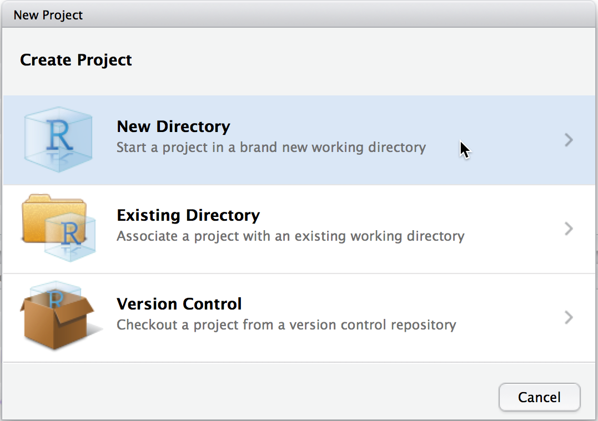
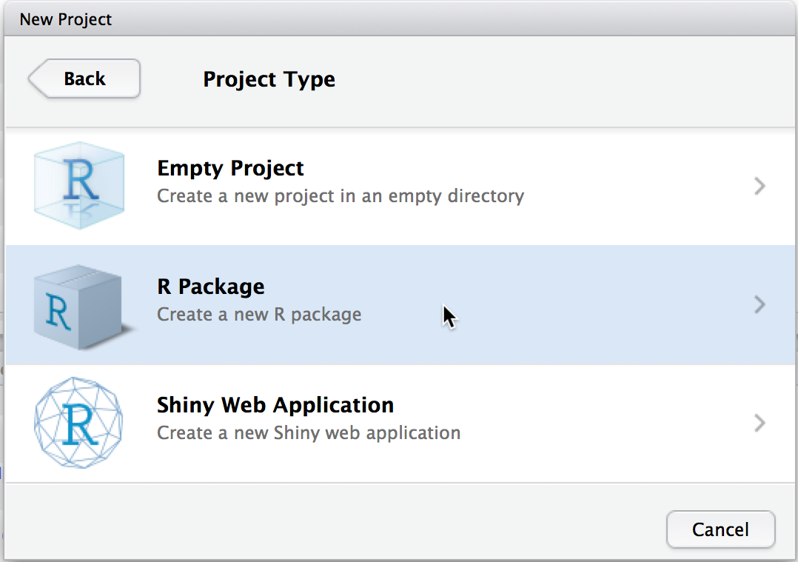
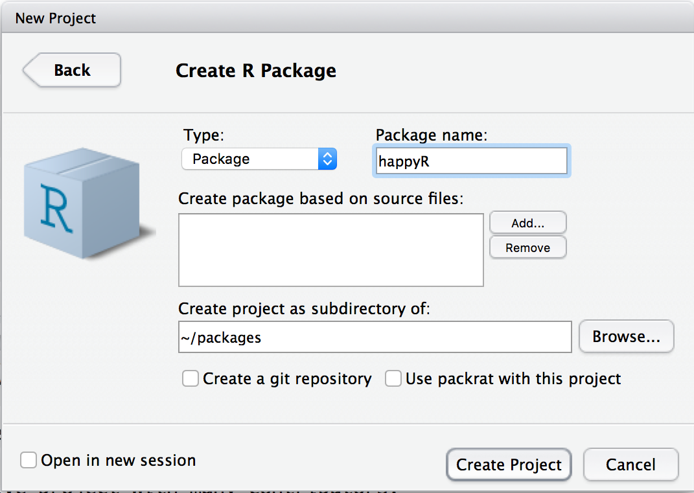

```{r setup, include=FALSE, message = F, warning = F}
knitr::opts_chunk$set(echo = FALSE, message = F, warning = F, error = F, dpi = 300, cache = T)
knitr::opts_chunk$set(dev.args=list(bg="transparent"))
library(tidyverse)
library(gridExtra)
```

## Resources

.large[
- [R Packages](https://r-pkgs.org/) by Hadley Wickham and Jenny Bryan
]
<br/><br/>
### Packages in this tutorial

devtools | roxygen2 | usethis | pkgdown
-------- | ------- | ------- | -------
 |  |  | 

.bottom[Slides modified from [Iowa State University Stat 585 materials](https://github.com/Stat585-at-ISU/materials-2019/)]

---
## Creating a package





.center[RStudio supports creating new packages. <br/>Follow the dialogs through `New Project ...`]

---
## Creating a package





.center[RStudio supports creating new packages. <br/>Follow the dialogs through `New Project ...`]

---
## Creating a package





.center[RStudio supports creating new packages. <br/>Follow the dialogs through `New Project ...`]

---
class:center,middle


---
class: inverse
## Try it out

- Create a new R package using the RStudio dialog to set it up in a new project.

- Build the package (Ctrl/CMD + shift + B) and run the function `hello()`

- Have a look at the help for `hello`

```{r eval = F, echo = T}
?hello
```

---

# `devtools`

Once you have a package, the `devtools` package provides functionality to support your development

`devtools` functions operate on the active project (the folder of your project):

- `document()` creates R help files from special comments in your code (talk about that in a bit)

- `install()` installs the package, i.e. afterwards you can activate the package with the command `library("your package")`

- `check()` runs a couple of tests on your package. All of these have to be passed without warning before you can upload a package to CRAN

---

## File structure

Within folder that has the same name as your R package:

- DESCRIPTION

- NAMESPACE

- R

- man

- data

R code files go into the folder `R`, data sets go into the folder `data`, Rd files contain documentation and go into `man`

---

## DESCRIPTION

plain text file with all the meta information on a package

```
Package: happyR
Type: Package
Title: What the Package Does (Title Case)
Version: 0.1.0
Author: Who wrote it
Maintainer: The package maintainer <yourself@somewhere.net>
Description: More about what it does (maybe more than one line)
    Use four spaces when indenting paragraphs within the Description.
License: What license is it under?
Encoding: UTF-8
LazyData: true
Imports: package1,package2
Suggests: package3
Depends: package4,package5
```

[Description file reference](http://r-pkgs.had.co.nz/description.html)

---

## Package dependencies: Imports, Suggests, Depends


- **Imports:** packages in this list must be present for your package to work
    - Imports are NOT attached when your package is loaded
    - You must refer to functions in these packages using `package::function()` or import them using roxygen tags (`@import`, `@importFrom`)


- **Suggests:** packages in this list may add functionality but are not necessary
    - e.g. for example data, unit tests, build vignettes

- **Depends:** packages in this list are attached when your package is loaded    
__Hint:__ It is better practice to use `Imports` rather than `Depends`. `Depends` might overwrite a previously loaded function of the same name (cause of some of the `plyr` - `dplyr` animosity)

[Namespaces reference](http://r-pkgs.had.co.nz/namespace.html#namespace) - why Depends is a bad idea

---

## Licenses

- There's a (surprising?) range of common use licenses available: http://www.r-project.org/Licenses/

- More licenses at http://creativecommons.org/choose/ and  http://www.opensource.org/licenses/category

- Flowchart for picking a [(type of) license](http://creativecommons.org.au/content/licensing-flowchart.pdf)

- Most often used: GPL-2, GPL-3, MIT

    - GPL-2/3: "run, copy, distribute, study, change and improve the software" now and in the future, i.e. preserve open-source nature

    - GPL-3 clears up some inconsistencies and ambiguities in GPL-2 and should be used in new projects

    - MIT releases software completely and also allows use in commercial projects, removes liability of provider.

---

## Documentation

hello.Rd:

```
\name{hello}
\alias{hello}
\title{Hello, World!}
\usage{
hello()
}
\description{
Prints 'Hello, world!'.
}
\examples{
hello()
}
```

`Rd` is the extension used for **R d**ocumentation.

Rd files are clearly structured, yet, we DO NOT want to write these ourselves (way too many places to mess up)

---

## The documentation workflow

1. Add tags  to your .R files in form of roxygen (next slide) comments

2. Run `devtools::document()` (or press `Ctrl/Cmd + Shift + D` in RStudio) to convert roxygen comments to .Rd files. 

3. Preview documentation with `?`.

4. Rinse and repeat until the documentation looks the way you want.

---

# Roxygen2

Roxygen comments start with `#'` to distinguish them from regular comments:

```
#' Add together two numbers.
#' 
#' @param x A number.
#' @param y A number.
#' @export
#' @return The sum of \code{x} and \code{y}.
#' @examples
#' add(1, 1)
#' add(10, 1)
add <- function(x, y) {
  x + y
}
```

---

## Roxygen2 and NAMESPACE

`@export`, `@import`, `@importFrom` do not write anything into the help file    
instead, they write to `NAMESPACE`

- `@export` makes the function visible to package users

- `@import` makes the imported package visible to the function code so you don't have to use `package::function()` notation

- `@importFrom` makes the imported function from the specified package visible (a more limited version of `@import`)

--

Note that Import in the DESCRIPTION file and `@import` for NAMESPACE aren't related - same word, two totally separate concepts

---

## Roxygenized example in `add.Rd`

```
% Generated by roxygen2 (4.0.0): do not edit by hand
\name{add}
\alias{add}
\title{Add together two numbers}
\usage{
add(x, y)
}
\arguments{
  \item{x}{A number}

  \item{y}{A number}
}
\value{
The sum of \code{x} and \code{y}
}
\description{
Add together two numbers
}
\examples{
add(1, 1)
add(10, 1)
}
```

---
class: inverse
## Try it out 

- Delete the file `hello.Rd` in the folder `man`

- Include roxygen comments for the function `hello()` in the file `hello.R` to create the same help for `hello` as was there before.

- Run `devtools::document()` to create the file `hello.Rd`. 

- Build the package and run `?hello`.

- Already done? Expand the functionality of `hello` to produce an output of `Hello, string!` for `hello(string)`. Update `?hello` accordingly.

---

## Roxygen tags

| Tag      | Purpose           |
| ------ |:------------------------------------------------------------------- |
| `@export` |	Make the function visible to users of the package |
| `@param` |	Describe inputs |
| `@return` |	Describe outputs |
| `@examples` |	Show how the function works |
| `@author`	| "Who wrote the function (if different from package)"|
| `@seealso` |	Pointers to related functions |
| `@aliases` |	Make it easier for users to find |
| `@rdname`	| Useful for functions that are invalid filenames and for combining docs |
| `@import` | Call all functions from another package natively (without package::function) |
| `@importFrom` | Call a single function from another package natively |

---

## Commands in Roxygen

| Tag      | Purpose           
| ------ |:------------------------------------------------------------------- |
| `\code{}` |	Discuss R code 
| `\link{}` | 	Make link to another function.  Usually wrapped in `\code{}`
| `\eqn{}` |	Inline equation (standard latex)
| `\emph{}` |	Italic text
| `\strong{}` |	Bold text

Numbered list (Use `\itemize{}` for bulleted):

```
\enumerate{
  \item First item
}
```

---
class: inverse
## Try it out

- Expand the functionality of `hello` to produce an output of `Hello, string!` for `hello(string)`. 

- Insert the corresponding roxygen tags to expand on the documentation

- Run `devtools::document()`

- Check that the help for `hello` is updated

---

# Usethis

The `usethis` package has a number of *very* helpful functions to set your package up

- `create_package` to create a package
- `use_github()` to use github with your package
- `use_data` to add data sets easily
- `use_xxx_license` to add a license (agpl3, apl2, mit, cc0, ccby)
- `use_testthat`, `use_coverage` to add tests and test coverage
- `use_spell_check`
- `use_pipe` - add magrittr pipe to the package
- `use_rcpp`
- `use_pkgdown` to build pkgdown sites
- `use_logo` to add a hex sticker

.center[and many more...]


---
class: inverse
## Try it out

`usethis` is a package to help with organizing your workflow in packages and non-package projects

Read through the [README](https://usethis.r-lib.org/) site of `usethis`.

Create a new package using `usethis` functionality. Make sure to not use `tempdir()` as the location for the new package, but a more suitable location.

Use `usethis` functionality to set up a README.Rmd file and a NEWS.md file.


---

## Data in a package

- Data frames must be stored in the `data` folder using the command `save`.

- Data the `usethis` way:

```
use_data
function (..., internal = FALSE, overwrite = FALSE, compress = "bzip2")
```

`use_data` places a data object into the `data` folder.

internal data (used by the package not by the users of a package) is placed in the file `sysdata.rda`


---

## Data documentation

- Documenting data in packages: http://r-pkgs.had.co.nz/data.html#documenting-data

```
#' Prices of 50,000 round cut diamonds.
#'
#' A dataset containing the prices and other attributes of almost 54,000
#' diamonds.
#'
#' @format A data frame with 53940 rows and 10 variables:
#' \describe{
#'   \item{price}{price, in US dollars}
#'   \item{carat}{weight of the diamond, in carats}
#'   ...
#' }
#' @source \url{http://www.diamondse.info/}
"diamonds"
```


General convention is to have a `data.r` file in the folder R that consists of data documentation.

---

## Examples in packages

- The Roxygen tag `@examples` allows you to write code as an example in the help file.

- Always make use of this feature! It is not only good practice, it is also a first step in checking that your package is running properly

- Your example has to be **stand alone**, i.e. if you are using some data, it needs to be included in the package.

```
#' @examples
#' # you can include comments
#' x <- 1
#' 5*x
#' hello("this is a test")
```


---

# Package website

The package `pkgdown` creates web pages based on all the files in a package

`pkgdown` supports making websites for your package (see e.g. [x3ptools](https://heike.github.io/x3ptools/), [ggplot2](https://ggplot2.tidyverse.org/), ... and soon yours)

Process:

```
pkgdown::build_site()
```


Assuming your package has a github repo, add the `docs` folder to the repo 

In `Settings` for your repo, switch GitHub Pages to the docs folder (see screenshot)

---


---

# Checking packages

- The Comprehensive R Archive Network (CRAN) is the place for publishing packages for general use.

- Once a package is on CRAN it can be installed using the command `install.packages("<package name>")`

- CRAN has installed certain rules that all packages must comply before being uploaded

`devtools::check()` or `Ctrl/Cmd + Shift + E` runs these tests on your local package

Similar to `install()` it looks for the package to check in the working directory

---

# Three levels of faults

- **`ERROR`**: severe problem that has to be fixed before submitting to CRAN - you should fix it anyway

- **`WARNING`**: also has to be fixed before going onto CRAN, but not as severe.

- **`NOTE`**: mild problem. You should try to get rid of all notes before submitting to CRAN, but sometimes there is a specific reason that does not allow you to fix all notes. In that case, write a careful description why this note happens in the submission comments.

---

# Checking cycle

```
R CMD check results
0 errors | 0 warnings | 0 notes 
```

This is what you want to see, but not a likely outcome of your first run in a real package


Checking workflow: 

1. Run `devtools::check()`, or press `Ctrl/Cmd + Shift + E`.

2. Fix the first problem.

3. Repeat until there are no more problems.


---

# Likely Problems

- missing documentation for functions and data

```
checking for code/documentation mismatches ... WARNING
Codoc mismatches from documentation object 'hello':
hello
  Code: function(string)
  Docs: function()
  Argument names in code not in docs:
    string
```    

- missing dependencies to other packages

```
checking dependencies in R code ... WARNING
'::' or ':::' import not declared from: ???stringr???
```
- making assumptions about data structures

```
checking R code for possible problems ... NOTE
hello: no visible binding for global variable ???string???
```


---
## Other things to check out

- Unit testing    
Make sure all of your functions work, keep bugs from reappearing, and track your package's reliability

- Continuous Integration w/ Github Actions or TravisCI    
Rebuild and check your package, build documentation, and run unit tests with every git commit

- Code coverage    
See what parts of your code have corresponding unit tests and which parts do not

- Package vignettes    
Longer-form demonstrations of package features. See e.g. the `imager` package, which has a great collection of vignettes.