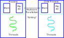
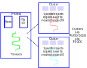

```{r setup, include=FALSE, message = F, warning = F}
knitr::opts_chunk$set(echo = FALSE, message = F, warning = F, error = F, dpi = 300, cache = T)
knitr::opts_chunk$set(dev.args=list(bg="transparent"))
library(tidyverse)
library(gridExtra)
```

## Resources

.large[
- [Parallel Computing intro](https://nceas.github.io/oss-lessons/parallel-computing-in-r/parallel-computing-in-r.html) by Matt Jones

- [Parallel Computation](https://bookdown.org/rdpeng/rprogdatascience/parallel-computation.html) by Roger Peng

]

---
## Basic Definitions

| Concurrent | Parallel |
| :----------: | :----------: |
|  |  |
| Multiple tasks in progress at one time | Multiple tasks run simultaneously |
| `future` package | `parallel` package |


.bottom[Images from [angelaholdsworth.com](https://www.angelaholdsworth.com/wp-content/uploads/2014/11/Mom-Juggling-671x1024.jpg) and gocomics.com via [Bill Watterson](https://www.gocomics.com/calvinandhobbes/1990/01/11)]

???

I like to think of concurrency as what moms tend to do- they're juggling multiple tasks simultaneously, but even if they switch tasks very quickly, they're still usually working on one task at a time. 

Parallel processing, however, is a different thing - it's like having multiple people, each doing their own task. 


---
## Basic Definitions

| Concurrent | Parallel |
| :----------: | :----------: |
|  |  |
| Multiple tasks in progress at one time | Multiple tasks run simultaneously |
| `future` package | `parallel` package |

.bottom[Images from [guru99.com](https://www.guru99.com/cpu-core-multicore-thread.html)]

???

To put this a different way, here are task graphs for concurrent and parallel processes. In parallel processing, all of the tasks are being worked on at the same time; in concurrent processing, there's only one task at a time, but the processor switches back and forth.

By default, R can do some things concurrently (though you can enhance its abilities using the future package). 

---
## Hidden Parallelism

- Most statistical calculations use linear algebra libraries written in e.g. C or C++
    - BLAS (basic linear algebra subroutines) libraries

- These  libraries have versions that are parallel by default
    - No special code
    - parallel computing handled for you automatically
    
- Microsoft R Open provides these libraries
    - You can also compile R against e.g. [parallel AMD/Intel libraries, Accellerate (mac), or ATLAS](https://bookdown.org/rdpeng/rprogdatascience/parallel-computation.html#hidden-parallelism) 
    - see the R installation manual [BLAS](https://cran.r-project.org/doc/manuals/r-release/R-admin.html#BLAS) section

???

There's one relatively simple way to take advantage of parallel processing without having to do anything to your code: by using libraries that do the linear algebra calculations that are parallel by default.

Microsoft R open is built with these libraries by default, but you can enable different libraries that aren't microsoft-specific in base R if you follow the R installation manual instructions. 

---
## Hidden Parallelism


[Speeds up certain tasks considerably](https://mran.microsoft.com/documents/rro/multithread) under the right circumstances

???

If Microsoft's benchmarks are to be believed, this can massively speed up certain calculations. It won't fix everything, of course. 

To talk more about parallelization, however, we're going to have to get into some computer architecture issues. So let's talk about processes, threads, and cores.

---
## Cores, Threads, Processes

.center[]

???

A thread is a job

A process is a set of one or more threads with some memory and file access

A core is the part of the computer that does the calculations

.bottom[Picture from https://medium.com/@tarunjain07/multi-vs-multi-cb9b0ec382ad]

---
## Cores, Threads, Processes

.center[]

.bottom[Picture from https://medium.com/@tarunjain07/multi-vs-multi-cb9b0ec382ad]

???

Some processors have hyper-threading - so a computer core can handle multiple "threads" at the same time. This is optimized on the processor level, and you generally don't have a lot of control over it other than being aware of how many parallel jobs you can assign to your machine.

What's important to remember in all of this is that any "thread" has some associated memory and information. The art of parallelizing your code is figuring out how to balance copying information around relative to how many threads you're running.

---
## Forking and Clustering

UNIX-based operating systems allow "forking" processes



- Entire R session is copied over (lazily)

- If you don't overwrite variables, this is fast (nothing actually copied)

- Spawns many different "child" processes, each theoretically assigned its own core

???

The reason this is important is that the operating system determines how the jobs are scheduled and how threads are allocated to hardware. In UNIX systems (mac and Linux) you can do something called "forking".

Essentially, the base process "spawns" a child process, copying memory and file access over, to carry out a new thread.

This is very fast (for the programmer), and very simple - you don't have to set up shared objects between threads, because the whole process is copied. Think of it as a clone, Calvin and Hobbes style. 

However, if you change any of those objects that get copied over, your memory usage can blow up very quickly. 

---
## Parallelization using `mclapply` 

```{r, echo = T}
library(parallel)
detectCores()

system.time(
r_serial <- lapply(1:10, function(i) {Sys.sleep(2)})
)

system.time(
r <- mclapply(1:10,  
              ## Do nothing for 2 seconds
              function(i) { Sys.sleep(2) }, 
              ## Split this job across 10 cores
              mc.cores = 10)      
)

```
???

Obviously, this is a pretty trivial parallel job. But, you can see how it's invoked - instead of lapply, you use mclapply. You tell it how many cores you want to use, and the parallel package handles the details. There's a slight increase in system time to handle the overhead, but overall it's approximately 10x faster to use mclapply.

If you use mclapply on Windows, you get default lapply behavior. So to handle parallel processing on Windows, you have to use a slightly different approach.

---
## Forking and Clutering

Windows doesn't allow forking. On Windows, you have to use a PSOCK cluster. 

.center.img75[]

- Explicitly copy data to/from clusters (takes time + memory)

???

Because this is controlled at the operating system level, you have to handle Windows separately. All operating systems allow PSOCK clusters, but they are more complicated to set up. 

In a PSOCK cluster, you have to explicitly copy over any packages or objects you need the parallel jobs to have access to. This is much more memory efficient than copying the entire process, but it also takes more user time, and specifying everything exactly takes more computer time. So there's a higher overhead, but the memory usage is more efficient.


---
## Parallelization using `makeCluster` 
```{r, echo = T}
library(parallel)
cl <- makePSOCKcluster(10)

system.time(
r_serial <- lapply(1:10, function(i) {Sys.sleep(2)})
)

system.time(
r <- parLapply(cl, # use the cluster 
               1:10,  
               ## Do nothing for 2 seconds
               function(i) { Sys.sleep(2) })      
)

stopCluster(cl)
```
???

In this trivial example, it is much faster to use a PSOCK cluster because there's nothing to copy over - no overhead - so the parallel jobs execute in nearly exactly the time you'd expect a parallel process to take.

---
## Parallelization using `makeCluster` 
```{r, echo = T}
library(parallel)
cl <- makeForkCluster(10)

system.time(
r_serial <- lapply(1:10, function(i) {Sys.sleep(2)})
)

system.time(
r <- parLapply(cl, # use the cluster 
               1:10,  
               ## Do nothing for 2 seconds
               function(i) { Sys.sleep(2) })      
)

stopCluster(cl)
```
???

If we instead make a Fork cluster, we have a bit more system overhead because the processes are copied over -- but not much, and it's not a hugely significant difference. 


---
## Concurrency with `future`

The `future` package is used to assist with concurrency - not holding up one result based on finishing another calculation.

.pull-left[
```{r, echo = T}
v <- {
  cat("Hello World")
  3.14
}

v

```

- Executed immediately
- value recalled when requested

].pull-right[
```{r, echo = T}
library(future)

v %<-% {
  cat("Hello World")
  3.14
}

v
```

- Executed only when value requested
- print statement happens upon value request
]

???

Why am I all of a sudden talking about concurrency?

This type of delayed evaluation can make parallelization very easy. 

We can choose to execute that future expression in a separate R process asynchronously. 


---
## Concurrency with `future`

The `future` package is used to assist with concurrency - not holding up one result based on finishing another calculation.

.pull-left[
```{r, echo = T}
v <- {
  cat("Hello World")
  3.14
}

v

```

- Executed immediately
- value recalled when requested

].pull-right[
```{r, echo = T}
library(future)
plan(multisession) # Use asynchronous separate process

v %<-% {
  cat("Hello World")
  3.14
}

v
```

- Executed only when value requested
- print statement happens upon value request
]

???

In this case, our main R session doesn't have to wait around for the results of the assignment of `v` - we only have to wait around for the result once we use `v` (e.g. print it out). 

---
## Futures

### Synchronous (non-parallel)
Name | OSes | Description
---- | ---- | ----
sequential |	all |	sequentially and in the current R process
transparent |	all |	as sequential w/ early signaling and w/out local (for debugging)

### Asynchronous (parallel)
Name | OSes | Description
---- | ---- | ----
multisession |	all |	background R sessions (on current machine)
multicore |	not Windows/not RStudio |	forked R processes (on current machine)
cluster |	all |	external R sessions on current, local, and/or remote machines
remote |	all |	Simple access to remote R sessions

???

Future tries to detect your global variables, export them automatically, and manage the resulting memory challenges. It's less to think about (when it works). 

The biggest reason (for me) to know about the future package is that it makes it easy to use the furrr package. Since I tend to use purrr variants instead of lapply, the furrr package makes it easy to parallelize code in-place. 

---
## "Embarrassingly Parallel"

- Multiple independent pieces of a problem are executed simultaneously

- Think bootstrap, drawing new samples, or even fitting models to different sets of data separately.

- You can use `mclapply`, `parLapply`, or the `furrr` package variants `future_map`, `future_pmap`, which have better type-specific options

```{r}
library(furrr)

# This uses PSOCK clusters
plan(multisession, workers = 8)
# Simple version
future_walk(1:10, ~Sys.sleep(2))
```


---
## "Embarrassingly Parallel" Problems

```{r, echo = T}
library(furrr)
data(txhousing)

# Fit a simple linear model
fit_gam <- function(.)
  lm(sales ~ factor(month) + year + listings, data = .)

# This uses PSOCK clusters
plan(multisession, workers = 8)
```

???

Here, let's suppose we want to fit a linear model for each city in the txhousing dataset.


---
## Data Transfer takes time!

```{r, echo = T}
# parallel
system.time(
txhousing %>%
  nest(-city) %>%
  mutate(model = future_map(data, fit_lm))
)

# not parallel
system.time(
txhousing %>%
  nest(-city) %>%
  mutate(model = map(data, fit_lm))
)
```

???

We find that it actually takes a lot more time to parallelize it than it does to not parallelize it, because data transfer between the processes is a significant component of the time. 


---
## Data Transfer takes time!

```{r, echo = T}
library(mgcv)
plan(multisession, workers = 6)
# Fit a simple gam model
fit_gam <- function(.)
  gam(sales ~ factor(month) + s(year, bs = 'ps') + s(listings), data = ., , method="REML")

# parallel
system.time(
txhousing %>%
  nest(-city) %>%
  mutate(model = future_map(data, fit_gam))
)

# not parallel
system.time(
txhousing %>%
  nest(-city) %>%
  mutate(model = map(data, fit_gam))
)
```

???

If we instead fit a more complicated model, the computational time we save by parallelizing is (sometimes) actually larger than the setup time for the cluster.
