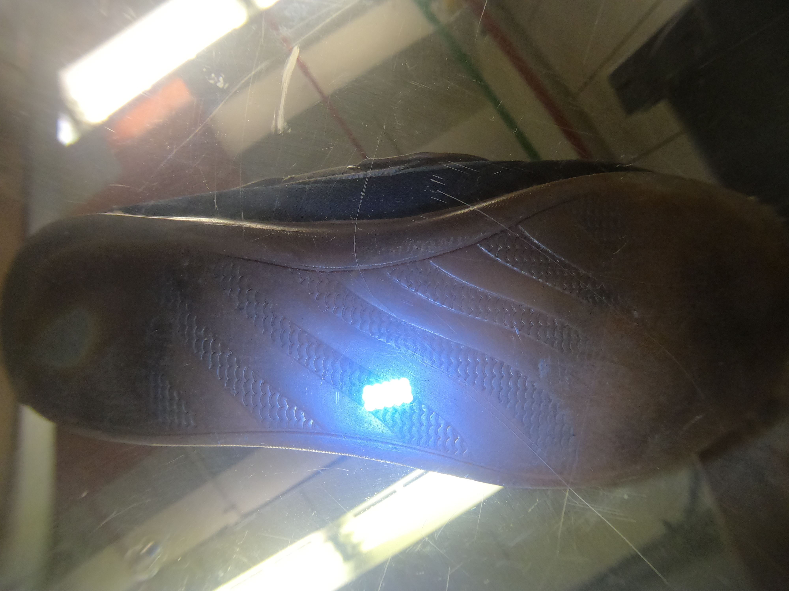
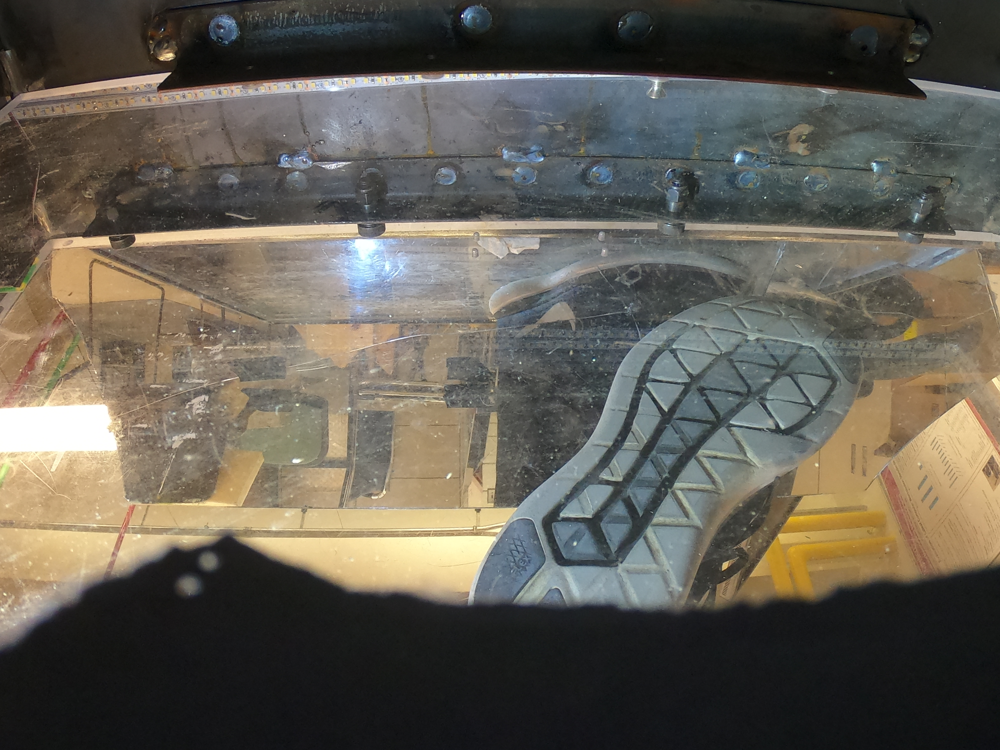
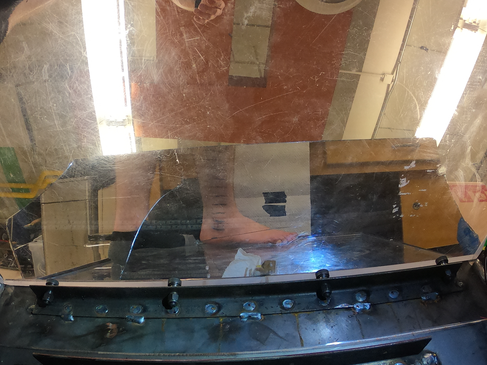

class: inverse, center, middle
# Project Status

---
class: primary-cyan
## Active: May - October 2020

- Work focused on the scanner internals, which are common to both the indoor (CSAFE-funded) and outdoor (NIJ funded) scanner

  - NIJ Award from 2019 had to be transferred to UNL
  - Engineering support essential over summer 2020 to get the project up and going

- once NIJ award was transferred, CSAFE project was paused

- Project is expected to resume in March 2022 when the NIJ grant ends.

---
class: inverse-blue, center, middle
# Goals and Progress

---
class: primary-blue
## Indoor scanner

Objectives | Date | Completion
---------- | ---- | ----------
Develop a modified scanner for use indoors | June 2023 | 50% complete
Webinar: Scanner and data collection project | June 2023 |
R package: Shoe image data | June 2024 | Initiated
Webinar: Class characteristic variability | June 2025 |
Guidelines: data collection | Dec 2025 |

- Core machine design: optics, equipment, power (shared b/w indoor and outdoor)
- Surface material selection (glass, acrylic, thickness, etc.)
- Glare reduction, Privacy filters (gel), and settings (camera focus)

 |  |  | 
:---: | :---: | :---: | :---: 
Unfiltered | Unfiltered | Gel | Glare reduction

---
class: secondary-blue,center
## Indoor Scanner

.img75[]
Determining camera focus depth to ensure privacy

IRB approved gel-free data collection outdoors (May 7, 2021)

---
class: primary-blue
## Population Class Chars

Objectives | Date | Completion
---------- | ---- | ----------
Develop LE Partnerships | June 2022 | Initiated
IRB Approval for data collection | Dec 2022 |
Data collection protocol (develop, test) | (June, Dec) 2023 | 
Paper: Class Char variability over time | Dec 2024 |
Paper: Class Char subpopulation variability | Dec 2025 |

### Unofficial Progress Report

- Training undergraduate and graduate students (NIJ project, outdoor scanner)

---
class: primary-blue
## Image Database

Objectives | Date | Completion
---------- | ---- | ----------
Dataset: Initial Release | Dec 2024 | 
Dataset: Rolling release updates | June, Dec 2025 |
Dataset: Annotated images | June, Dec 2025 | 

### Unofficial Progress Report

- [Developing annotation schemes](images/Labling scheme. pic.pdf) (Xinyu Liu, UNL undergraduate)

---
class:middle,center,inverse-cyan
# Questions?

Email **susan.vanderplas@unl.edu** or **rstone@iastate.edu**

