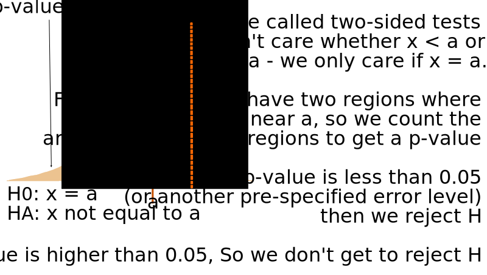
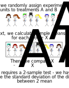
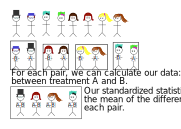

```{r setup, include=FALSE}
options(htmltools.dir.version = FALSE)
library(shiny)
library(shinydashboard)
```


# Outline

- The Logic of Statistical Hypothesis Testing

- Simulation Based Analysis

- Estimating Values

- Experimental Design

---
# A Lady Tasting Tea

Can someone tell whether tea or milk is added first to a cup?

- 4 cups of tea with milk first `r icon("coffee", style = "color: #d2b48c")`, 4 cups of tea with tea first `r icon("coffee", style = "color: #835C3B")`

- Randomize the order

- Test the cups and make predictions for all 8 cups

.center.large.cerulean.emph[What is the probability that someone gets all 8 correct?]

---
# A Lady Tasting Tea

- If the 4 milk cups  `r icon("coffee", style = "color: #d2b48c")` are correctly identified, so are the 4 tea cups `r icon("coffee", style = "color: #835C3B")`

- If we assume that the taster is just guessing, we could just as easily flip 4 coins
    
    - Class option: Have each student flip a coin 4x
    
    - Computer option: Simulate 4 coin flips x N trials

---
# A Lady Tasting Tea

.large.emph.cerulean[Statistical evaluation]

- Null hypothesis: Taster is guessing

- If our experimental results are likely to occur by random chance, we can't really say whether the taster is guessing or not    
`r icon("share")` We fail to reject the null hypothesis

- If our experimental results are not likely to occur by random chance, we may decide it's more likely that there is another explanation... the taster knows their stuff!

.large.emph.cerulean.center[What matters is that we have strong evidence that our results could not occur with random chance alone.]

---
class: inverse
# Try it out

Go to shiny.srvanderplas.com/APL and start with the Tea Tasting tab. 

- What effect does the number of simulations have on the results?

- What effect does the number of test cups have on the results?
    - Assuming the number of observed cups is the same as the number of test cups
    
    - Assuming the number of observed cups is less than the number of test cups

---
# Hypothesis Testing Logic

.pull-left[
1. Run an experiment and generate an observed value

2. Simulate a large number of experiments under random chance (the null hypothesis)

3. Compare the observed value to the results of the simulated experiments

4. Decide whether the observed value is plausible under random chance, or it is more likely that the results would happen if the null hypothesis is wrong
].pull-right[

]

---
# Theory-based Statistics
.pull-left[
1. Run an experiment and generate a test statistic (t, z, F, $\chi^2$)

2. Compare the observed value to the theoretical distribution

3. Decide whether the observed value is plausible under random chance, or it is more likely that the results would happen if the null hypothesis is wrong
].pull-right[

]

---
class: inverse
# Try it out


Go to shiny.srvanderplas.com/APL and start with the Distributions tab. 

- What changes when you change distribution?

- How many samples do you need for the simulation histogram to look similar to the theoretical distribution?

- What effect does setting your observed value to be larger have on the p-value?    
Note: At this point, we are doing tests examining values greater than the observed value. This will obviously not always hold true.

- How different is the simulation p-value from the theoretical p-value? Does this change when you increase the number of samples?
    
---
## Underlying Logic - Testing

- In both cases, the goal is to determine if the experiment results are compatible with the null hypothesis

- if the region that is "more extreme" than the observed value is very small, then the experimental results are surprising
    - This suggests the null hypothesis might not be reliable
    - May lead to rejecting the null hypothesis in favor of the alternative (if the null is false, what does that imply?)

- the region that is "more extreme" than the observed value is summarized as the p-value -- the area of that region.
    - p-values lower than $\alpha$, a pre-specified cutoff (0.05 or 0.01 is common) are considered "statistically significant" - that is, they should lead to a rejection of the null hypothesis

---
## Underlying Logic - P-values


---
## Underlying Logic - Two Sided Tests



You can experiment with two-sided tests here:

https://shiny.srvanderplas.com/APL/ and click on "One Continuous Variable"

---
# Confidence Intervals

- Another way to use statistics is to get a range of "plausible" values based on the estimate + variability

- This is called a **confidence interval**

.center[]


---
# Confidence Intervals

- Every confidence interval has a "level" of $1-\alpha$, just like every hypothesis test has a significance level $\alpha$

- Confidence intervals with higher levels (e.g. .99 instead of .95) are wider

- Interval width depends on 
    - sample size
    - variability
    - confidence level
    
- A CI of (A, B) is read as "We are 95% confident that the true value of \_\_\_\_\_\_\_\_\_ lies between A and B"

---
class:middle,inverse
# Experimental Design

---
## One Categorical Variable

- Statistic: # Successes (out of # Trials)

- Simulation method: Flip coins $(p = 0.5)$, weighted spinners $(p\neq 0.5)$

- Theoretical distribution: Binomial

https://shiny.srvanderplas.com/APL/ and click on "One Categorical Variable"


---
## One Continuous Variable

- Statistic: $$t = \frac{\overline x - \mu}{s/\sqrt{n}}$$
where $\overline x$ is the sample mean, $s$ is the sample standard deviation, $\mu$ is the hypothesized mean, and $n$ is the sample size

- Simulation method: none

- Theoretical distribution: $t$ with $n-1$ degrees of freedom

https://shiny.srvanderplas.com/APL/ and click on "One Continuous Variable"

---
## Categorical + Continuous Variables
### Two-group Tests

- Categorical variable: Group 1 or Group 2?
- Continuous variable: Some measurement

- Statistic: $\overline x_1 - \overline x_2$

- Simulation method: shuffle group labels (flash cards if by hand)

- Theoretical distribution: $t$ (degrees of freedom are a bit complicated)


https://shiny.srvanderplas.com/APL/ and click on "Categorical + Continuous Variables"

---
## Categorical + Continuous Variables
### Two-group Tests





---
## Categorical + Continuous Variables
### Repeated Measures


---
## Categorical + Continuous Variables
### Matched Pairs




---
## Analysis of Variance

In some cases, we're interested in multiple groups, not just 2. For these situations, we use ANOVA (ANalysis Of VAriance).

Suppose we have a group of schoolchildren separated by grade, and we want to examine the relationship between grade and height.


---
## Analysis of Variance

.pull-left[

].pull-right[
If height is important, students in a single grade should be more similar than students across different grades.
]

---
## Analysis of Variance

.pull-left[
To determine similarity within groups, we square the deviations from the group mean and add them up - this is the within-groups sum-of-squares.

We can then calculate the between-groups sum-of-squares as the sum of squared differences of the class average and the overall average for each student.
].pull-right[

]

---
## Analysis of Variance

Results from ANOVA are shown in tables like this: 

```{r, include = F}
library(tidyverse)

data <- tibble(group = rep(1:3, each = 6), 
       groupavg = rep(c(41, 43, 47), each = 6),
       dev = c(0, 3, -1, 0, -1, -1, -1, -1, 2, -2, 1, 1, 0, 0, 0, 0, -2, 2))

data <- mutate(data, height = groupavg + dev, grade = factor(group))

anova(lm(height ~ grade, data = data))
```
```{r, echo = F}
options(knitr.kable.NA = '') 
as_tibble(anova(lm(height ~ grade, data = data))) %>%
  mutate(Factor = c("grade", "Residuals")) %>%
  select(Factor, everything()) %>%
  bind_rows(tibble(Factor = "Total", Df = 17, `Sum Sq` = 144, `Mean Sq` = NA, `F value` = NA, `Pr(>F)` = NA)) %>%
  knitr::kable()
```

The F-value is the statistic, and is compared to an F(df1, df2) distribution - in this case, F(2, 15) to get a p-value.

---
## Two Continuous Variables


---
## Two Continuous Variables


---
## Two Continuous Variables


---
## Two Continuous Variables

- Continuous variables: $x$ and $y$

- Statistic: $a$, the sample slope

- Simulation method: shuffle values of $y$ relative to $x$

- Theoretical distribution: $t_{n-2}$, where $n$ is the number of observations
