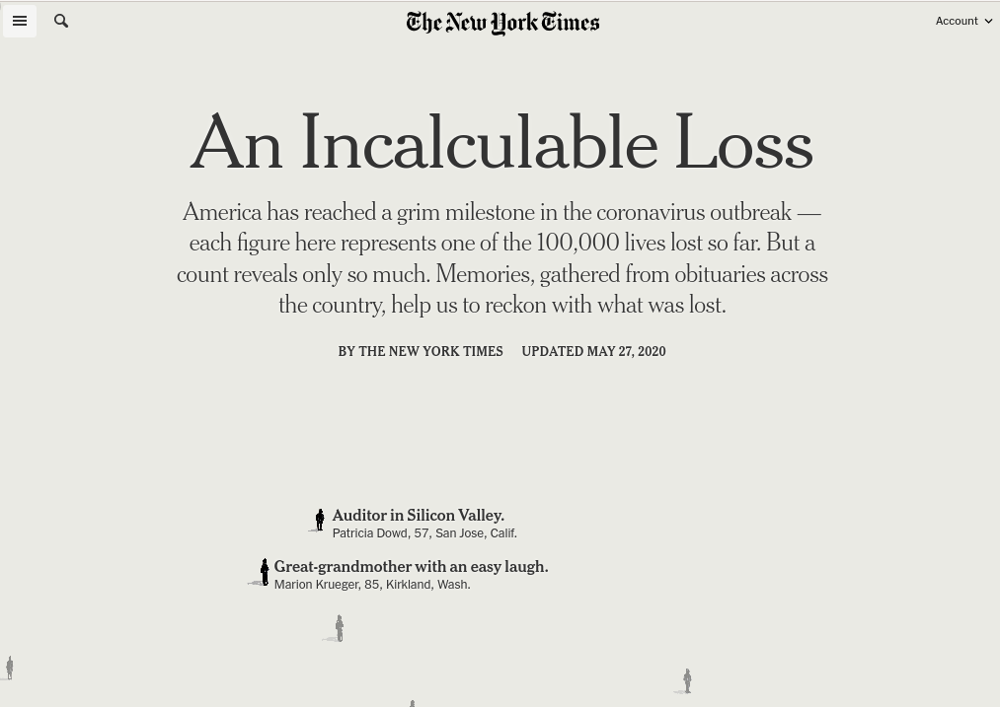

```{css, echo = F}
.wrap
{
  width: 1050px;
  height: 550px;
  padding: 0;
  overflow: hidden;
  position: absolute;
}
.wrap2
{
  width: 1200px;
  height: 650px;
  padding: 0;
  overflow: hidden;
}


.scale-frame
{
  width: 1100px;
  height: 760px;
  border: 0;
  
  -ms-transform: scale(0.75);
  -moz-transform: scale(0.75);
  -o-transform: scale(0.75);
  -webkit-transform: scale(0.75);
  transform: scale(0.75);
  
  -ms-transform-origin: 0 0;
  -moz-transform-origin: 0 0;
  -o-transform-origin: 0 0;
  -webkit-transform-origin: 0 0;
  transform-origin: 0 0;
}
```

```{r setup, include=FALSE}
options(htmltools.dir.version = FALSE)
knitr::opts_chunk$set(echo = F, cache = F, 
                      dpi = 300, fig.width = 6, fig.height = 15/4, 
                      message = F, warning = F, 
                      dev.args=list(bg="transparent"))

# Read in the data from NYT
library(tidyverse)
library(lubridate)
library(zoo)
library(ggrepel)
library(gridExtra)

my_theme <- theme_bw() + 
  theme(plot.background = element_rect(fill = "transparent", color = NA), 
        panel.background = element_rect(fill = "transparent", color = NA), 
        legend.background = element_rect(fill = "transparent", color = NA),
        axis.text.y = element_text(angle = 90, hjust = 0.5)) 
theme_set(my_theme)

```

```{r colorpals, include = F}
main_colors <- c("#d00000", "#f5f1e7", "#c7c8ca")

# use as accents
secondary_colors <- c("#001226", "#249ab5")

# These are only to be used for infographics/charts
tertiary_colors <- c("#bccb2a", "#f58a1f", "#005d84", "#ffd74f", "#a5228d")

color_palette <- c("#d00000", "#249ab5",  "#1B8500", "#f58a1f", "#a5228d", "#001226", "#B1EB66", "#005d84", "#c25700")

heat_color_palette <- c("#ffd74f", "#f58a1f", "#c25700", "#d00000", "#9D0000", "#6A0000")

blueseqpal <- c("001226", "06293E", "0C3F56", "12566E", "186D85", "1E839D", 
                "249AB5", 
                "39ABC1", "4EBCCE", "64CDDA", "79DDE6", "8EEEF3", "A3FFFF") %>% 
  paste0("#", .) %>% rev()

blueseqpal_lt <- rev(c("#B2FFFF", "#C2FFFF", "#D1FFFF", "#E0FFFF", "#F0FFFF"))

darkblueseqpal <- colorspace::darken(blueseqpal, .2)
lightblueseqpal <- colorspace::lighten(blueseqpal, .2)
```

```{r modals, include = F, eval = T}
clean_file_name <- function(x) {
  basename(x) %>% str_remove("\\..*?$") %>% str_remove_all("[^[A-z0-9_]]")
}

img_modal <- function(src, alt = "", id = clean_file_name(src), other = "") {
  
  other_arg <- paste0("'", as.character(other), "'") %>%
    paste(names(other), ., sep = "=") %>%
    paste(collapse = " ")
  
  js <- glue::glue("<script>
        /* Get the modal*/
          var modal{id} = document.getElementById('modal{id}');
        /* Get the image and insert it inside the modal - use its 'alt' text as a caption*/
          var img{id} = document.getElementById('img{id}');
          var modalImg{id} = document.getElementById('imgmodal{id}');
          var captionText{id} = document.getElementById('caption{id}');
          img{id}.onclick = function(){{
            modal{id}.style.display = 'block';
            modalImg{id}.src = this.src;
            captionText{id}.innerHTML = this.alt;
          }}
          /* When the user clicks on the modalImg, close it*/
          modalImg{id}.onclick = function() {{
            modal{id}.style.display = 'none';
          }}
</script>")
  
  html <- glue::glue(
    " <!-- Trigger the Modal -->


<!-- The Modal -->
<div id='modal{id}' class='modal'>

  <!-- Modal Content (The Image) -->
  

  <!-- Modal Caption (Image Text) -->
  <div id='caption{id}' class='modal-caption small'></div>
</div>
"
  )
  write(js, file = "libs/js-addins.html", append = T)
  return(html)
}

# Clean the file out at the start of the compilation
write("", file = "libs/js-addins.html")
```

<!-- 
In 2020, there was suddenly worldwide interest in graphics on a level we don't normally see - people were checking news sites daily looking for graphs, maps, and any information about how the COVID pandemic was progressing over time. 

Along with this, there were some very novel forms of graphics, some of which worked and many of which did not. 

As the pandemic continued, however, most news organizations seemed to settle on certain categories of graphics for displaying COVID case counts, hospitalizations, and deaths. Watching the pandemic and the graphics explosion that resulted, I found relatively little research into how people perceive exponential growth, and even less research into the effectiveness of log scales for conveying information. 

I'll talk about a series of experiments that are currently under development to explore these two topics, as well as the evolution of graphics over the course of the pandemic.  -->

## Outline

- Past Pandemic Graphs

- Early COVID Graphs

- Settled Graphical Forms

- Perception and Log Scales

---
## Past Pandemics in Graphical Form

```{r Past-pandemic-graphs, results='asis', echo = F, cache=F}
i1 <- img_modal("1918-Funston.png", "Reproduction from the Journal of the American Medical Association, Jan 11, 1919. Image from https://flickr.com/photos/medicalmuseum/40347344610/",  other=list(style="object-fit:contain;max-width:49%;max-height:500px;margin-left:auto;margin-right:auto;width:45%"))
i2 <- img_modal("1840_cholera_mortality_temperature_london.png", "Excess Mortality and Temperature, 1840s London.",   other=list(style="object-fit:contain;max-width:49%;max-height:500px;margin-left:auto;margin-right:auto;width:45%"))
i3 <- img_modal("Influenza-1919-majorcities.png", "Influenza in Major Cities, 1918-1919",  other=list(style="object-fit:contain;max-width:49%;max-height:500px;margin-left:auto;margin-right:auto;width:45%"))
i4 <- img_modal("Cholera_plague_london.png", "Cholera & Plague in London (Created 1849)",   other=list(style="object-fit:contain;max-width:49%;max-height:500px;margin-left:auto;margin-right:auto;width:45%"))
c(str_split(i1, "\\n", simplify = T)[1:2],
  str_split(i2, "\\n", simplify = T)[1:2],
  str_split(i1, "\\n", simplify = T)[3:12],
  str_split(i2, "\\n", simplify = T)[3:12],
  str_split(i3, "\\n", simplify = T)[1:2],
  str_split(i4, "\\n", simplify = T)[1:2],
  str_split(i3, "\\n", simplify = T)[3:12],
  str_split(i4, "\\n", simplify = T)[3:12]) %>%
  cat()
```


???

One of the biggest challenges that we faced early on is that the scales we started out with weren't sufficient for the magnitude of the problem we were facing later. It turns out that this isn't really special - people have dealt with it before... Note that the one graph that doesn't seem to go off the charts completely is one that was created well after the peak and uses standard cartesian coordinates. If it were radial (as the plague/cholera graphs are) then it would look quite a bit different.


---
## An Explosion of Graphics - COVID

```{r Covid-creativity, results='asis', echo = F, cache=F}
i1 <- img_modal("abomination.png", "May 6 2020: Three graphs that show a global slowdown in COVID-19 deaths, https://theconversation.com/three-graphs-that-show-a-global-slowdown-in-covid-19-deaths-135756",  other=list(style="object-fit:contain;max-width:49%;max-height:500px;margin-left:auto;margin-right:auto;width:45%"))
i2 <- img_modal("bubble-charts.png", "Active Cases vs. Total Deaths (Reddit, May 9 2020: https://i.redd.it/8lasbu2rspx41.png)",   other=list(style="object-fit:contain;max-width:49%;max-height:500px;margin-left:auto;margin-right:auto;width:45%"))
i3 <- img_modal("tests-vs-cases.png", "Tests vs. Cases, Our World in Data (May 19 2020)",  other=list(style="object-fit:contain;max-width:49%;max-height:500px;margin-left:auto;margin-right:auto;width:45%"))
i4 <- img_modal("triangles.png", "Rate of Death Change, July 10, 2020",   other=list(style="object-fit:contain;max-width:49%;max-height:500px;margin-left:auto;margin-right:auto;width:45%"))
c(str_split(i1, "\\n", simplify = T)[1:2],
  str_split(i2, "\\n", simplify = T)[1:2],
  str_split(i1, "\\n", simplify = T)[3:12],
  str_split(i2, "\\n", simplify = T)[3:12],
  str_split(i3, "\\n", simplify = T)[1:2],
  str_split(i4, "\\n", simplify = T)[1:2],
  str_split(i3, "\\n", simplify = T)[3:12],
  str_split(i4, "\\n", simplify = T)[3:12]) %>%
  cat()
```

???

In the late spring of 2020 (and into the summer) we saw a huge explosion of different types of graphs - creative in both form and in composition (that is, which variables were place). There were also attempts made to sonify graphics - the triangle chart in the bottom left is one which is easily transitioned to a sound. 

Obviously, not all of these graphics are readable, but I find the fact that most of the ones I've shown you here are "loopy" to be quite interesting - people seemed to want to show a return to "normal" in various ways, and that desire showed up in the graphics they selected.

---
## An Explosion of Graphics - COVID

<div class="wrap">
<iframe class="scale-frame" src = "https://xkcd.com/2294/" width = "100%" height = "500px"/></div>

???

Of course, you don't have to take my word for it - even XKCD noted that the creation of new covid graphs was a bit out of control. 

Someday, I'm going to manage to cite XKCD in a paper, and this is one of the top contenders right now.

---
## An Explosion of Graphics - COVID

[](https://www.nytimes.com/interactive/2020/05/24/us/us-coronavirus-deaths-100000.html)

???

Of course, there are other ways to visualize the magnitude of the problem. I'm sure you've all seen by now the NYT front page from May 24, 2020, but if you haven't, I think this might be best termed "Data Visceralization" instead of Visualization - making you *feel* the magnitude of the loss instead of just noting its numeric value. That's a term that I've lifted from the book Data Feminism, which is a great read if you're interested in thinking about data science in a different way.

---
## Enduring COVID Graphics


<div class="wrap">
<iframe class="scale-frame" src ="https://ig.ft.com/coronavirus-chart/?areas=usa&areas=ind&areasRegional=usny&areasRegional=usnj&areasRegional=usca&areasRegional=usnd&areasRegional=ussd&areasRegional=usmi&cumulative=0&logScale=1&per100K=1&startDate=2020-09-01&values=cases#chart-world" width = "100%" height = "500px"/></div>

???

I got annoyed with trying to link to NYT graphs because I can't use iframes to include them, so here's a financial times graph that by default is on a log scale and scales covid counts by population, but has options to change both of these things if you so desire. In general, though, it seems like most graphs waver back and forth between linear and log scales depending on the application, while many places have gone to categorical color schemes when case counts are represented using a color/fill aesthetic. This to some degree solves the problem of scaling colors - for a while, many state dashboards had major issues with county-level maps, because they kept the color scale the same as cases rose exponentially, until finally the entire map was the same color and the map was meaningless. Alternately, they scaled the colors each day automatically, and it looked like the situation wasn't any more dire than it had been a month ago, which also was a problematic message to send. Unsurprisingly, these mistakes happened systematically in states which had every political reason to downplay the pandemic, though I'm sure that they also occurred occasionally in states that were taking things seriously - it's just that those states likely noticed the issue and reacted to it, while states like Iowa and Nebraska... didn't. 

---
## Enduring Covid Graphics

<blockquote class="twitter-tweet"><p lang="en" dir="ltr">NEW: B.1617.2 is fuelling a third wave in the UK, with not only cases but also hospital admissions rising.<br><br>Vaccines will make this wave different to those that have come before, but it remains a concern, and one that other countries will soon face.<br><br>Thread on everything we know: <a href="https://t.co/4825qOqgrl">pic.twitter.com/4825qOqgrl</a></p>&mdash; John Burn-Murdoch (@jburnmurdoch) <a href="https://twitter.com/jburnmurdoch/status/1397995388267810818?ref_src=twsrc%5Etfw">May 27, 2021</a></blockquote> <script async src="https://platform.twitter.com/widgets.js" charset="utf-8"></script> 

???

Even at this stage in the pandemic, we're still seeing situations where it makes sense just to totally go off the limits of the chart. While previous pandemics may not have let us track genetic variants like this, the same graphical techniques seem to hold up over time...


---
## Exponential Growth, Log Scales, and Perception

- Log scales may lead to misinterpretation of trends in the data
  - .small[Menge, D. N. L., MacPherson, A. C., Bytnerowicz, T. A., Quebbeman, A. W., Schwartz, N. B., Taylor, B. N., & Wolf, A. A. (2018). Logarithmic scales in ecological data presentation may cause misinterpretation. Nature Ecology & Evolution, 2(9), 1393-1402. https://doi.org/10.1038/s41559-018-0610-7]

- People are generally awful at forecasting exponential growth - systematically tend to under-predict
  - .small[Timmers, H., & Wagenaar, W. A. (1977). Inverse statistics and misperception of exponential growth. Perception & Psychophysics, 21(6), 558-562. https://doi.org/10.3758/BF03198737]
  - .small[Wagenaar, W. A., & Timmers, H. (1978). Extrapolation of exponential time series is not enhanced by having more data points. Perception & Psychophysics, 24(2), 182-184. https://doi.org/10.3758/BF03199548]

- Increasing # points helps with perception of linear growth but doesn't help as much with asymptotic or exponential growth
  - .small[Best, L. A., Smith, L. D., & Stubbs, D. A. (2007). Perception of linear and nonlinear trends: using slope and curvature information to make trend discriminations. Perceptual and Motor Skills, 104(3), 707-721.]

???

None of these studies examined the use of log scales in ways similar to the use during COVID. They also weren't clear and a few had some methodological issues in how they were conducted. The general conclusion I can draw from these papers isn't that reassuring, though - log scales aren't well studied perceptually, but we probably suck at them, and we also don't handle predictions from exponential growth well -- neither conclusion is reassuring during a pandemic. But how can you provide decent guidance about good graphics during a pandemic if you don't have good research to back it up with?

---
## Exponential Growth, Log Scales, and Perception

- Question 1: Can we **perceive** differences in exponential growth rates on log and linear scales?

- Question 2: Can we **predict/forecast accurately** for exponential (or linear) growth using log and linear scales?

- Question 3: Can we **use** graphs with exponential data to draw conclusions accurately using log or linear scales?

.center.large.cerulean.emph[3 different ways of engaging with the data]
.large.cerulean.emph[
- Perceptual
- Tactile
- Intellectual
]

???

I'm a huge fan of lineups, but one of the issues I had with the COVID graphs I was seeing was that I wasn't convinced people were *interpreting* the data correctly (because around me, they were still acting like idiots). I started thinking about why lineups wouldn't test things at the level I was hoping for, and eventually came up with this hierarchy - first, you have to be able to recognize that there is a difference between two things. Then, you have to be able to predict and forecast to map "data from the past" onto the future. Finally, you have to actually be able to read data off of the graph and act on it - doing numerical calculations and the like. These are distinct psychological tasks, and they require different ways of interacting with a chart. So I'm going to describe 2 experiments that we've conducted (and a 3rd that we're still working on) relating to log scales. These experiments were inspired by COVID, but we're working hard to not go anywhere near COVID data because while we were designing these experiments, it was a bit emotionally loaded - people were dropping like flies, and adding emotional stuff into my experiment didn't seem optimal. Now that things are calming down in the US, we probably *could* use COVID data, but I'd just as soon stay away from it just the same -- the pandemic isn't over in most of the rest of the world either.


---
class:middle,center,inverse
## Q1: Perception of Differences

.large.center[https://shiny.srvanderplas.com/log-study/]

???

If you're interested, you could take a few minutes and do this study if you didn't see us advertising on Twitter last summer. I'd prefer you do the study before I give away all the answers, though, so if you're going to do it, please go ahead and start :).

In the meantime, I'm happy to take some questions about the stuff I've talked about up to this point.

---
## Q1: Perception of Differences


- Factorial Experiment:
  - Log/linear scale (2 levels)
  - Lineup composition: (6 levels)
      - Target plot - easy (high curvature), medium (noticeable curvature), hard (low curvature)
     - Null plots - easy (high curvature), medium (noticeable curvature), hard (low curvature)
      - Exclude combinations where target/null are the same
  - Low/High variability (2 levels)

- Included 6 Rorschach plots (3 curvature levels x log or linear scale)

.center.emph.cerulean[12 lineups + 1 Rorshcach plots = 13 evaluations per person]

- 58 participants completed 518 lineup evaluations
  - Remove 17 participants completing < 6 evaluations)
  - Final total: 477 lineup evaluations

???

Our first level of engagement is basic perception - can we actually distinguish different growth rates/levels of curvature on a linear and log scale. This is the most basic thing -- if we can't do this, then we probably won't be able to predict things well or read information off the graph well (though, that last point is arguable). 


---
## Q1: Perception of Differences

$$
y_i  = \alpha\cdot e^{\beta\cdot x_i + \epsilon_i} + \theta 
\text{ with } \epsilon_i \sim N(0, \sigma^2). \nonumber
$$
- Manipulate $\beta$ and $\sigma$ systematically

- Adjust $\alpha$ and $\theta$ to ensure that the range and domain constraints are met 
    - Necessary so that curvature is the only major cue in the lineup

???


To set this up with lineups, we have to do a few fiddly things - like ensuring that the range is similar for each level of curvature. This means that we ended up with a heuristic for generating data according to a basic exponential model with multiplicative errors. 

The addition of the $\theta$ parameter means that our log scale graphs will have some curvature in some cases. It's complicated, but we ended up deciding that it was better to have curvature be the "cue" than to have range be the cue. Hard choices, really, but we did make an attempt to minimize $\theta$ and primarily manipulate $\alpha$. 

We used a lack-of-fit statistic to ensure that the easy, medium, and hard levels were in fact statistically distinct as well as visually distinct - I'm not showing this part of the data generation process because it's a bit beside the point once the lineups are generated, but it's worth mentioning that we didn't just pick values randomly - we specifically were trying to ensure that the lack-of-fit (relative to a linear graph) was significantly different between different parameter settings.


---
## Q1: Perception of Differences


```{r Log-scale-lineup, results='asis', echo = F, cache=F}
i1 <- img_modal("log-lineup-example.png", "Log Scale", 
                other = list(style = "object-fit:contain;max-width:49%; max-height:500px;margin-left:auto; margin-right:auto;width:49%"))
i2 <- img_modal("linear-lineup-example.png", "Linear Scale",
                other = list(style = "object-fit:contain;max-width:49%; max-height:500px;margin-left:auto; margin-right:auto;width:49%"))

c(str_split(i2, "\\n", simplify = T)[1:2],
  str_split(i1, "\\n", simplify = T)[1:2],
  str_split(i2, "\\n", simplify = T)[3:12],
  str_split(i1, "\\n", simplify = T)[3:12]) %>%
  cat()
```

???

Here are a couple of example lineups from this experiment - the first is on a linear scale, the 2nd is on a log scale. While I generally tried throughout these experiments to make it clear that we were on a log scale, it is a very subtle difference in these lineups, and fixing that wasn't necessarily relevant to the question at hand -- since all sub-panels have the same axis breaks, we're actually testing whether we can distinguish the data, not the scales.

---
## Q1: Perception of Differences

```{r odds-ratio-plot, eval = T, fig.width = 5, fig.height = 2, fig.align='center', message = F, warning = F}
library(tidyverse)
slice_curvature <- read_csv("results/jsm-student-paper-slicediffs.csv") %>%
  select(SimpleEffectLevel, test_param,	"_test_param", OddsRatio,	Alpha,	Lower,	Upper,	AdjLower,	AdjUpper,	LowerOR,	UpperOR,	AdjLowerOR,	AdjUpperOR) %>%
  na.omit() %>%
  extract(SimpleEffectLevel, into = c("Target", "Null"), "curvature t-([MEH])_n-([EMH])", remove = F) %>%
  mutate(Target = factor(Target, levels = c("E", "M", "H"), labels = c("Easy", "Medium", "Hard")),
         Null = factor(Null, levels = c("E", "M", "H"), labels = c("Easy", "Medium", "Hard")))

dodge <- position_dodge(width=0.9)
odds_ratio_plot <- slice_curvature %>%
  ggplot(aes(x = OddsRatio, y = Null, color = Target, shape = Target)) + 
  geom_point(position = dodge, size = 3) + 
  geom_errorbar(aes(xmin = LowerOR, xmax = UpperOR), position = dodge, width = .1) +
  geom_vline(xintercept = 1) +
  theme_bw()  +
  theme(axis.title = element_text(size = 8),
        axis.text = element_text(size = 8),
        legend.title = element_text(size = 8),
        legend.text  = element_text(size = 8),
        legend.key.size = unit(0.7, "line")
        ) +
  scale_y_discrete("Null plot type") +
  scale_x_continuous("Odds ratio (on log scale) \n (Log vs Linear)", trans = "log10") + 
  scale_color_manual("Target Plot Type", values = c("#004400", "#116611", "#55aa55")) + 
  scale_shape_discrete("Target Plot Type")
odds_ratio_plot
```

- It's easier to spot a curve among a bunch of lines than it is to spot a line among a bunch of curves

- Log scales make us more sensitive to slight changes in curvature: 
    - Medium Null - Easy Target
    - Medium Null - Hard Target
    - Easy Null - Medium Target


???

We used a generalized linear mixed effects model to assess the probability of a correct target identification given factors like target and null plot type, participant skill level, and random effects due to the data generating process.  The plot shown here is the resulting log odds ratio for log vs. linear scales, and we see that it is easier to detect curvature among a field of null lines than it is to detect linearity among a field of curved lines. In addition, we see that when there is a lot of contrast between the null and the target plot, that is, when the nulls are very curved and the target is very straight, there isn't much difference between the two graphs. However, if there is less contrast, the log scale allows us to perceive the differences better than the linear scale. 

This is still pilot data - obviously, we will be rerunning this experiment with a larger sample size, but because we have 3 ways of engaging with the data, we're planning to run a large omnibus study where we can assess participants' engagement on each level -- that is, we want to be able to use the same participants for each of the experiments I'm going to talk about today, and compare their skill levels. 

---
class:middle,center,inverse
## Q2: Can we predict/forecast exponential trends?

.large.center[https://shiny.srvanderplas.com/you-draw-it/]

???

The next question we had was whether we can accurately predict/forecast exponential trends. This study is quite different from the last one in that you'll be required to actually draw graphs using a mouse or tablet. 

If the gifs don't load for you initially, please just refresh the page and they should load. I'm not sure why that happens, but I haven't succeeded in fixing it yet.

While you are taking that, if you want to do so, I'll talk a little bit about some studies about statistics "by eye", which is something I find rather fascinating. 

---
## Hand-Drawn Regression Studies

[D. J. Finney (1951) Subjective Judgment in Statistical Analysis: An Experimental Study  *Journal of the Royal Statistical Society*](https://rss.onlinelibrary.wiley.com/doi/abs/10.1111/j.2517-6161.1951.tb00093.x)

- **Big Idea:** Determine the effect of stopping iterative maximum likelihood calculations after one iteration.
- **Method:** Judge by eye the positions for a pair of *parallel* probit regression lines in a biological assay. Sent out by mail, asked to "rule two lines."
- **Sample:** 21 scientists
- **Findings:** One cycle of iteration was sufficient.


[Frederick Mosteller, Andrew F. Siegel, Edward Trapido & Cleo Youtz (1981) Eye Fitting Straight Lines *The American Statistician*](https://www.tandfonline.com/doi/abs/10.1080/00031305.1981.10479335)

- **Big Idea:** Students fitted lines by eye to four sets of points.
- **Method:** 8.5 x 11 inch transparency with a straight line etched completely across the
middle.
- **Sample:** 153 graduate students and post docs in Introductory Biostatistics.
- **Experimental Design:** Latin square with packets stapled in four different orders.
- **Findings:** Students tended to fit the slope of the first principal component.

???

There have been a number of statistical experiments with "eye fitting" regression models, in part driven by the desire to understand perception, but also as a computational shortcut (which is thankfully not necessary these days, but it's still a cool historical tidbit). 

The first study, Finney, compared eye-fit probit lines with one iteration of ML results. The subjects for the Finney study were deliberately chosen as. having no' experience with probit methods.

The second study, which is more psychological in nature, had students line up a transparency with a straight line on it to fit a regression line to some data. 
They used four different data sets, and found that students tended to fit the slope of the first PC rather than the least squares line. Now, it's not clear that Mosteller et al. had enough data to differentiate between the first PC and actual regression - that observation seems to be primarily something they noticed while exploring the responses, but that doesn't make it wrong -- it's just hard to differentiate between the two hypotheses.

The methods changed a bit, but the basic concept is the same.


---
## You Draw It (NYT)
<br/><br/>
- [Family Income affects college chances](https://www.nytimes.com/interactive/2015/05/28/upshot/you-draw-it-how-family-income-affects-childrens-college-chances.html)


- [Just How Bad Is the Drug Overdose Epidemic?](https://www.nytimes.com/interactive/2017/04/14/upshot/drug-overdose-epidemic-you-draw-it.html)


- [What Got Better or Worse During Obama’s Presidency](https://www.nytimes.com/interactive/2017/01/15/us/politics/you-draw-obama-legacy.html?_r=0)

???

The New York Times has a really cool setup that they use relatively frequently to have people predict data before showing them the actual trend. They use javascript to have people actually draw on the plot -- which we decided to steal for our purposes, because it's a very tactile thing. 

There are downsides -- the "draw a smoother" doesn't have the same kinds of restrictions that the e.g. transparency method did, but when dealing with exponential data, we were pretty sure we didn't want to impose a specific functional form, because it's not totally clear that people are thinking exponentially or are actually good at drawing exponential curves. The other major downside is that if you go too fast you can get a very jerky line, which isn't super-optimal either. 


---
## Q2: Forecasting (You-Draw-It)

- Goal 1: Replicate Eye Fitting Straight Lines using the you-draw-it tool
    - not fundamentally required to make straight lines... 
    - 4 datasets: F, N, S, V (from the original paper)
    
- Goal 2: Explore exponential growth predictions on log and linear scale
    - Points end 50% or 75% of the way across x-axis
    - Rate of growth of $\beta$ = 0.1, 0.23
    - Log or Linear scale

.emph.cerulean.large.center[12 total graphs to complete]

???

So now I'll start talking about how we set this experiment up. First, I wanted to validate the "Eye fitting straight lines" method using You Draw it - because there are major differences in how the lines actually appear (and the structure), I wanted to see what the differences between the two studies were. 

Then, the (main) goal is to see how terrible we are at predicting exponential growth when using a log scale and a linear scale. We set things up with varying amounts of data -- so you have data to base your regression line up to either halfway or 3/4 of the way through the graph, and you have to then extend beyond the data by 25% or 50%. Obviously, we expected that 50% would have more errors, but that's not that shocking -- we just wanted to see how far "off" we get. We used two different rates of growth, and then either had a graph with a log or linear scale. If you're keeping track, then there are 4 straight lines, and 8 sets of exponential data (generated on the fly from basic parameters). We saved both the data shown on the plot and the drawn smooth lines.


```{r obtain-data}
library(RSQLite)
library(DBI)
library(tidyverse)
library(lme4)
library(lmerTest)
library(emmeans)

# Connect to database
filename <- "you_draw_it_data.db"
sqlite.driver <- dbDriver("SQLite")
db_con <- dbConnect(sqlite.driver, dbname = filename)
# dbListTables(db_con)

# Import exponential prediction parameter details
exp_parameter_details <- dbReadTable(db_con,"exp_parameter_details") %>%
  mutate(beta = as.factor(as.character(beta)),
         sd = as.factor(as.character(sd)))

# Import user data
users <- dbReadTable(db_con,"users") %>%
  filter(study_starttime > 1620152231) %>%
  select(-ip_address) %>%
  mutate(participantID = as.factor(as.character(as.numeric(as.factor(paste(nick_name, "_", study_starttime, sep = ""))))))

# Import exponential prediction feedback data
exp_feedback <- dbReadTable(db_con,"feedback") %>%
  filter(study_starttime > 1620152231) %>%
  filter(parm_id %in% c("beta0.1-10-true",  "beta0.1-10-false", 
                        "beta0.1-15-true",  "beta0.1-15-false", 
                        "beta0.23-10-true", "beta0.23-10-false",
                        "beta0.23-15-true", "beta0.23-15-false")) %>%
  separate(parm_id, into = c("beta", "points_end", "linear"), sep = "-") %>%
  mutate(beta = substr(beta, 5, 8)) %>%
  left_join(exp_parameter_details, by = "beta") %>%
  mutate(scale = ifelse(linear == "true", "Linear", "Log"),
         residual.drawn = ydrawn - y) %>%
  left_join(users, by = c("nick_name", "study_starttime")) %>%
  filter(recruitment != "I am the researcher") %>%
  mutate(plotID = as.factor(as.character(as.numeric(as.factor(paste(nick_name, "_", start_time, "_", end_time, sep = ""))))),
         beta = as.factor(as.character(beta)),
         sd = as.factor(as.character(sd)),
         points_end = as.factor(as.character(points_end)))

# Import exponential prediction simulated data
exp_simulated_data <- dbReadTable(db_con,"simulated_data") %>%
  filter(study_starttime > 1620152231) %>%
  filter(parm_id %in% c("beta0.1-10-true",  "beta0.1-10-false", 
                        "beta0.1-15-true",  "beta0.1-15-false", 
                        "beta0.23-10-true", "beta0.23-10-false",
                        "beta0.23-15-true", "beta0.23-15-false")) %>%
  separate(parm_id, into = c("beta", "points_end", "linear"), sep = "-") %>%
  mutate(beta = substr(beta, 5, 8),
         scale = ifelse(linear == "true", "Linear", "Log")) %>%
  left_join(exp_parameter_details, by = "beta") %>%
  left_join(users, by = c("nick_name", "study_starttime")) %>%
  filter(recruitment != "I am the researcher") %>%
  mutate(beta = as.factor(as.character(beta)),
         sd = as.factor(as.character(sd)),
         points_end = as.factor(as.character(points_end)))

# Disconnect from database
dbDisconnect(db_con)


# Fit Loess Smoother
loess.models <- exp_feedback %>%
        tidyr::nest(-plotID) %>%
        dplyr::mutate(
                # Perform loess calculation on each plotID
                loess.fit = purrr::map(data, loess,
                               formula = ydrawn ~ x),
                # Retrieve the fitted values from each model
                yloess = purrr::map(loess.fit, `[[`, "fitted")
        )

# Apply fitted y's as a new column
exp_feedback.smooth <- loess.models %>%
        dplyr::select(-loess.fit) %>%
        tidyr::unnest(cols = c(data, yloess)) %>%
  mutate(residual.loess = yloess - y) %>%
  mutate(points_end = str_replace_all(points_end, c("10" = "50%", "15" = "75%"))) %>%
  select(participantID, age, gender, academic_study, recruitment, plotID, scale, beta, sd, points_end, x, y, ydrawn, yloess, residual.drawn, residual.loess, nick_name, study_starttime, start_time, end_time)

factorCols <- c("plotID", "nick_name", "study_starttime", "beta", "sd", "points_end", "scale", "age", "gender", "academic_study", "recruitment", "participantID")
exp_feedback.smooth[,factorCols] <- lapply(exp_feedback.smooth[,factorCols], factor)

# summary(exp_feedback.smooth)
```

---
## Q2: Forecasting (You-Draw-It)


```{r spaghetti-all-overlaid-no-smoother, fig.width = 8, fig.height = 4}
p1 <- exp_simulated_data %>%
  filter(dataset == "line_data") %>%
  mutate(points_end = str_replace_all(points_end, c("10" = "50%", "15" = "75%"))) %>%
  arrange(participantID, x) %>%
  ggplot(aes(x = x)) +
  ylab("Y value (as drawn)") + 
  # geom_line(alpha = 0.3, aes(y = y, group = participantID)) +
  geom_line(data = exp_feedback.smooth, aes(y = ydrawn, group = plotID, color = scale), alpha = 0.3) +
  facet_grid(beta ~ points_end, scales = "free", labeller = labeller(beta = label_both, points_end = label_both)) +
  theme_bw() +
  theme(legend.position = "bottom") +
  scale_color_manual("Scale", values = c("steelblue", "orange")) +
  scale_x_continuous(limits = c(10, 20))

p2 <- exp_feedback.smooth %>%
  arrange(participantID, scale, x) %>%
  ggplot(aes(x = x, y = residual.drawn, group = plotID, color = scale)) +
  ylab("Residual") + 
  geom_line(alpha = 0.3) +
  geom_hline(yintercept = 0, color = "black", linetype = "dashed", alpha = 0.5) +
  facet_grid(beta ~ points_end, scales = "free", labeller = labeller(beta = label_both, points_end = label_both)) +
  theme_bw() +
  theme(legend.position = "bottom") +
  scale_color_manual("Scale", values = c("steelblue", "orange"))
p1
```

???

We are still working out some kinks in how to analyze this experiment's data -- obviously, we care about residuals, but SSE isn't a good metric - we'll have to figure out how to analyze things in a way that actually tells us how systematic the under-prediction is. One way to do that might be to fit an exponential function to the hand-drawn line and examine the parameters, but there are other ways. For the pilot study, though, we didn't have a huge amount of data, so we are contenting ourselves with looking at the spaghetti plots. 

Here, I'm showing you the actual drawn lines for each of the exponential conditions, and you can see that there are a few interesting features:

1. Not everyone drew very smooth lines -- we probably need to do some data cleaning based on the number of sharp "jumps" in the data -- possibly excluding those cases or smoothing over them.

2. The amount of deviation in the final prediction value is (surprisingly) not much larger when there is less data -- this was really shocking for me

3. Linear scale predictions seem to be lower than log scale predictions, in particular when beta is higher -- it's not that noticeable when beta is low. So the under-prediction bias is stronger for linear scales than it is for log scales. That doesn't necessarily mean that everyone underpredicts, but you do see way more orange lines on top in the lower right panel. 

---
## Q2: Forecasting (You-Draw-It)

```{r spaghetti-all-overlaid-no-smoother2, fig.width = 8, fig.height = 4}
p2
```

???

If we look at the residuals instead, we see that there is still some under-prediction even with the log scale when beta is high, but our basic conclusions from the original plots still hold. The only thing that doesn't completely hold is that when there is data through 75% of the graph, we do see a lot less variability there than when there is only data through 50% of the graph, at least for the smaller $\beta$ value. 


---
class:middle,center,inverse

## Can we estimate numerical quantities from exponential data shown on log/linear scales?

---
## Q3: Numerical Estimation

- Next level of engagement is estimating quantities from a graph

- This is a much harder experiment to set up
    - Phrasing matters a lot!
    - Data matters a lot!
    
    
.center.large.emph.cerulean[How to make it generalizable?]

???

One of my favorite parts of graphical inference is that it totally sidesteps this question of phrasing by encoding all of what would have been verbal questions into the graph itself. This really is a huge improvement over past graphical methods -- there were studies showing that pie charts sucked from the early 1900s, but they were hampered by the generalizability of the questions - if you asked for someone to estimate the percentage of a pie slice, you got different conclusions than if you asked someone to make a judgement between two pieces of the pie. 

I haven't yet figured out how to measure our ability to estimate numerical quantities and read them off of graphs without being subject to this phrasing issue. So one of the tasks Emily and Reka and I are taking on this summer is to test language for asking these questions, and also to find good real-world data sets to use when we do this part of the experiment. 


What I'm going to show you now is what we've come up with so far, but I'm happy to hear your thoughts on the pros/cons of this way of asking questions...


---
## Q3: Numerical Estimation

```{r estimation-example, fig.width = 8, fig.height = 3.5}
mem_path <- file.path("data", "mem-disk-price.xlsx")
if (!file.exists(mem_path)) download.file("https://jcmit.net/MemDiskPrice-xl95.xls", mem_path, mode = "wb")

cnames <- c("dec_date", "price_per_mb", "year", "md", "ref1", "ref2", "ref3", "size_kb", "price", "speed", "memtype")
ctype <- c(rep("numeric", 3), rep("text", 4), rep("numeric", 2), rep("text", 2), rep("skip", 3))
mem <- readxl::read_xls(mem_path, sheet = "MEMORY", skip = 4, col_names= cnames, col_types = ctype)
mem$mb_per_dollar <- 1/mem$price_per_mb

df <- select(mem, dec_date, value = mb_per_dollar) %>%
  mutate(type = "Memory", unit = "MB per $1 spent", scenario = 1)

cnames <- c("obs", "dec_date", "old_hd_price_mb", "floppy_price_mb", "hd_price_mb", "year", "md", "ref1", "ref2", "sales", "manuf", "model", "size", "type", "speed", "rotate", "cache", "size_mb", "cost")
ctype <- c(rep("numeric", 5), "skip", "skip", "numeric", rep("text", 8), rep("numeric", 2), "text", "numeric", "numeric")
hd <- readxl::read_xls(mem_path, sheet = "DDRIVES", skip = 4, col_names = cnames, col_types = ctype)  %>%
  pivot_longer(old_hd_price_mb:hd_price_mb, names_to = "disk_type", values_to = "price_per_mb") %>%
  mutate(disk_type = str_remove(disk_type, "_price_mb")) %>%
  filter(dec_date >= 1980, !is.na(price_per_mb)) %>%
  # filter(disk_type == "hd") %>%
  mutate(mb_per_dollar = 1/price_per_mb) %>%
  select(dec_date, year, md, size_mb, cost, disk_type, price_per_mb, mb_per_dollar)

df <- bind_rows(
  df,
  select(hd, dec_date, value = mb_per_dollar) %>%
    mutate(type = "Hard Drive Capacity", unit = "MB per $1 spent", scenario = 2)
)
filter(df, scenario == 1, dec_date >= 1980) %>%
ggplot(data = ., aes(x = dec_date, y = value)) + 
  scale_x_continuous("Date") + 
  scale_y_continuous("Memory (MB per $1 spent)", breaks = c(0, 50, 100, 150, 200, 250, 300, 350, 400, 450, 500), minor_breaks = seq(0, 500, 25)) + 
  geom_point()

```

.slightly-small[
> This plot shows the amount of computer memory (RAM) which could be obtained for $1 between 1980 and 2020. The price of computer memory dropped dramatically, leading to a considerable increase in the amount of memory which could be purchased for a given dollar amount. The y-axis is shown in 50-MB increments, with lighter gridlines at 25-MB increments.
]

---
## Q3: Numerical Estimation

```{r estimation-example2, fig.width = 8, fig.height = 3.5}
filter(df, scenario == 1, dec_date >= 1980) %>%
ggplot(data = ., aes(x = dec_date, y = value)) + 
  scale_x_continuous("Date") + 
  scale_y_log10("Memory (MB per $1 spent)", breaks = c(1) %*% t(10^(-4:2)) %>% sort(), minor_breaks = c(2.5, 5, 7.5) %*% t(10^(-4:2)) %>% sort()) + 
  geom_point()

```

.slightly-small[
> This plot shows the amount of computer memory (RAM) which could be obtained for $1 between 1980 and 2020. The price of computer memory dropped dramatically, leading to a considerable increase in the amount of memory which could be purchased for a given dollar amount. The y-axis is shown on log (base 10) scale, with labeled gridlines at 1 for each order of magnitude, and lighter gridlines at 2.5, 5, and 7.5. So between 1 and 10, there are labeled gridlines at 1 and 10, and lighter gridlines at 2.5, 5, and 7.5.
]

---
## Q3: Numerical Estimation

Example Questions:

- How much memory could you purchase with $100 in 2020? Please answer in MB.
    - Directly read off the graph

- In 2020, you could buy approximately \_\_\_ times the memory as in 2000, for the same money.    
.small[(If you could buy 3x the memory, answer 3)]
    - Requires reading 2 values off the graph and dividing, or using ratio information from log-axis scale.
    
    
.emph.large.cerulean[Still to do:]
- Finalize datasets (preferably non-covid related)
- Finalize and standardize question language
- Run pilot study


???

My plan is to ask at least 2 questions using each graph - one that requires direct estimation -- reading data off of the graph, and one that requires some sort of relative judgement -- so estimating a ratio.

This should showcase the advantages of linear and log graphs both, but I'm not sure that the phrasing is sufficiently simple that it will work.


---
## Overall Log Study

- Recruit ~200 participants from Prolific/MTurk/etc.
  - Hopefully matching demographics of the general population
  
- Each participant takes each of the 3 studies

- Compare performance across study design (general skill with log/linear scales) as well as across participants

.center.cerulean.large.emph[Goal is to understand how we deal with exponentially increasing data at multiple levels of engagement]

.center.cerulean.large.emph[Data collection in Fall 2021]

???

Once we've gotten the issues with study 3 straightened out, the plan is to collect a full set of data using the same participants for each part of the study. This will allow us to do cross-task assessments as well as allowing us to ensure that we have a more representative sample than what we can get recruiting on Twitter and Reddit :). Right now, we're planning to start the full data collection portion of the study this fall. 


---
class:middle,center,inverse

## Questions?